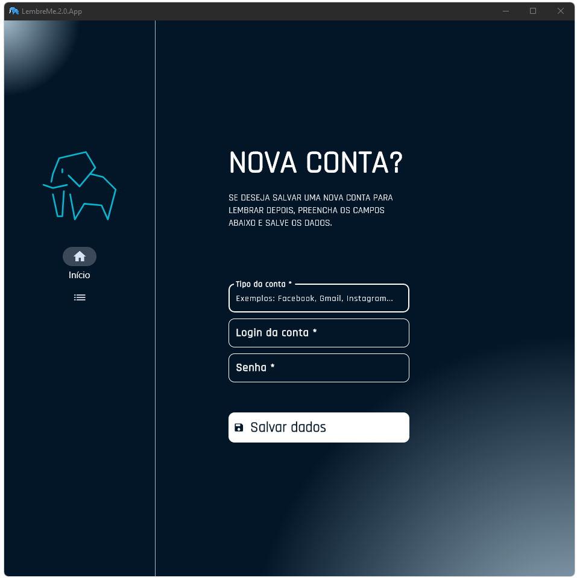

# Conversor de imagens

## Problema:

&nbsp;Meu pai frequentemente me pedia ajuda para redefinir a senha de suas contas do Google, Facebook e outras plataformas. Como ele não tem muita familiaridade com computadores, além de assistir vídeos no YouTube e navegar no Facebook, decidi criar uma solução mais eficiente para ajudá-lo com isso.

## Objetivo:

- &nbsp;Desenvolver um software para gerenciar suas contas, permitindo a consulta de logins e senhas, além da opção de adicionar novas contas ou remover aquelas que não são mais necessárias.

- &nbsp;Criar uma interface simples e intuitiva, garantindo uma experiência fácil de usar.

- &nbsp;Aproveitar o desenvolvimento como uma oportunidade para explorar e compreender, na prática, uma arquitetura de software eficiente, com foco na integração e comunicação entre os módulos do sistema.

## Sobe o Projeto:

&nbsp;O projeto é uma plataforma desktop que facilita o gerenciamento de todas as suas contas, permitindo o acesso rápido a informações como login e senha. Com isso, você se mantém organizado e evita esquecimentos.

### Funcionalidades:

- Consultar dados de login e senha.
- Adiconar novas contas quando nescessário.
- Deletar contas quando nescessário.
- Editar informações de login e senha quando nescessário.

### Como funciona:

## Tecnologias utilizadas:

- Python
- Flet

## Requisitos:

- Windows
- Descktop, notebook e outros, exceto dispositivos mobile.

## Equipe:

Leandro Camilo.

## Feedback Pessoal:

&nbsp;Desenvolver este software foi um desafio, especialmente na modularização dos controles do Flet e suas funcionalidades. No início, parecia complexo, mas acabou se tornando uma excelente oportunidade de aprendizado. Ao longo do processo, aprofundei meus conhecimentos em desenvolvimento com Flet no Python e superei obstáculos que fortaleceram minha confiança e aprimoraram minhas habilidades técnicas.

&nbsp;No final, fiquei satisfeito com a solução funcional e eficiente, além do aprendizado valioso adquirido no processo.
